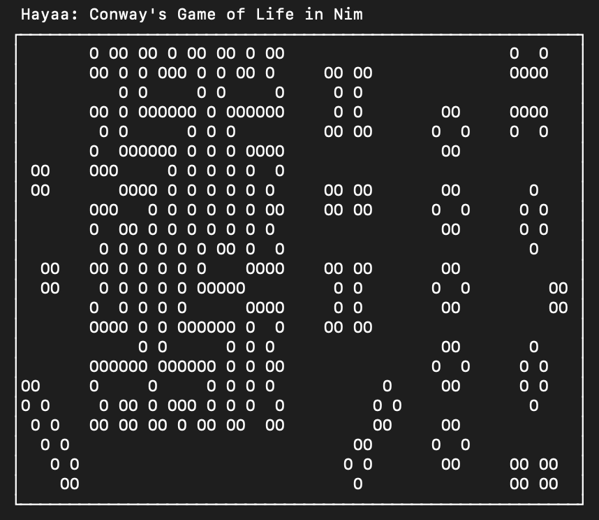

# Hayaa 0.3.0

`hayaa` is a terminal implementation of Conway's Game of Life.

The name "Hayaa" comes from the Arabic word الحياة *al-Ḥayaa*, meaning "life".

## Install with [Nimble](https://github.com/nim-lang/nimble)

To install Hayaa, run `nimble install hayaa`.

## Notes
* This isn't *truly* Conway's game, as there are edges to the board (your terminal's borders).
* Note that the console input seems to miss quite a few keystrokes on Windows. I'm not sure why yet.
* I wrote this to try out Nim. It is by no means idiomatic Nim.
